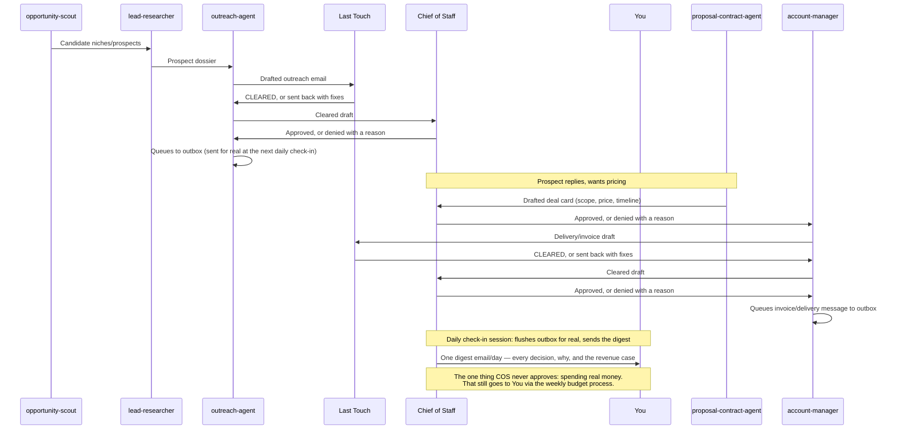

# Deal Desk — Approval Workflow

**Updated 2026-09-24 per the owner's direct instruction:** agents no
longer wait for the owner's personal sign-off to send an email, post
publicly, finalize deal terms, or deploy a client build. **Chief of
Staff** approves or denies those on the owner's behalf, once a day. The
**one exception** is anything that spends real money — that still needs
the owner, via the weekly budget process in `OPERATIONS.md`.



## Last Touch — the mandatory quality gate (unchanged)

Every department's client-facing output (an email, a proposal, a social
post, an invoice, a delivered build's copy) routes through **Last
Touch** before it can be approved — not optional, not skippable for a
"quick" one:

1. **Grammar & Copy Editor** — grammar, spelling, clarity
2. **Visual & Formatting Reviewer** — layout, formatting, broken assets
3. **Tone & Sensitivity Reviewer** — offensive language, insensitive
   phrasing, anything that could upset a customer (a single flagged
   line blocks the whole piece)
4. **Brand Consistency Checker** — matches `BRAND.md` exactly (signed as
   Ava/Edgex, correct pricing, GDPR-safe for EU)
5. **Final Release Coordinator** — confirms all four passed, stamps
   **CLEARED — LAST TOUCH**, hands it back to the department that owns
   delivery

## Legal Desk: the law check (added 2026-09-26)

After Last Touch, every outbound item goes to the **Legal Desk**. All ten
counsel check it: advertising, anti-spam, privacy, copyright, trademark,
financial content, platform rules, kids and COPPA, and contracts, with General
Counsel giving one verdict. The details are in `LEGAL-DESK.md`. Chief of Staff
can't approve anything without a `cleared` review in `legal_reviews`. A fix
sends it back to its author, then through Last Touch again.

Last Touch clearing something is **not** the same as it being sent —
Chief of Staff's approval below still happens on every single one. Last
Touch's job is making sure what's being approved is already clean.

## The approval point: Chief of Staff, not the owner

**Every client-facing action** — an outbound email, a deal card, a
delivery message, an invoice, a deploy — goes to **Chief of Staff**
(`ai-workforce/agents/chief-of-staff.md`) once it clears Last Touch and the
Legal Desk.
Chief of Staff checks it against `BRAND.md`, the studio's catalog, and
plain judgment, then approves or denies it. Approved work goes out
immediately — the agent that owns it sends/posts/finalizes/deploys
itself, no further confirmation from anyone. A denial goes back to
whichever agent owns the fix, with Chief of Staff's specific reason.

**Every decision is logged** — approved or denied, which agent, which
action, the reason, and (for an approval) the concrete revenue case —
to the `decisions` collection on the live status board.

**Once a day, Chief of Staff's decisions become one email** to the
owner (`hetilpatel500@gmail.com`): what was decided, why, and how it's
expected to make money. This is a report, not a request — the owner
reads it after the fact, the same way they'd review a team's daily
standup notes, not a queue of things waiting on them.

**Deal cards** still follow this shape, produced by
`proposal-contract-agent` before anything is proposed to a client:

```
DEAL CARD
Client: <name>
Service: <one of the playbook's Section 11 offerings>
Price: $<amount>
Scope: <2-3 bullets, exactly what's included>
Timeline: <days>
Payment terms: <e.g. 50% upfront, 50% on delivery>
```

Chief of Staff approves, denies, or sends it back for a revision. Only
after approval does `account-manager` send it to the client or move a
job into delivery.

## The honest mechanical limit on "sends itself"

Routines in this account can't hold a Gmail connector — only a live,
connected chat session can. So the hourly autonomous shift (which runs
as a fresh, connector-less session so it survives this conversation
ending) can draft, clear Last Touch, and have Chief of Staff approve or
deny — but it queues an approved item to **`outbox`**
(`status:"approved_pending_send"`) instead of literally sending it. A
**separate daily Routine** wakes this specific chat session (which does
hold Gmail) once a day: it sends anything queued in `outbox` for real,
updates the matching `deals` step once it actually goes out, and sends
the one digest email covering everything `decisions` logged. If this
chat session is ever archived or expires, that daily send stops until a
connected session processes the queue again — this is a real platform
constraint, not a design choice, and it's the reason "approved" and
"sent" are two different states you'll see in the data.

## The one thing that still comes to the owner

**Anything that spends the studio's own money** — ad budget, a paid
tool, a new phone number or hosting plan, anything with an actual bill —
is never Chief of Staff's to approve. That goes through the weekly
budget process in `OPERATIONS.md` and needs the owner's explicit
approval, exactly as before. A client-facing action that also requires
spending money splits in two: Chief of Staff can clear the client-facing
part, but the spend itself waits on the owner.

## What never happens automatically, even now

- Nothing skips Last Touch, ever, for any reason.
- Nothing skips the Legal Desk, ever. No `cleared` legal review, no approval.
- Nothing skips Chief of Staff's review and logged decision, even
  something that feels "routine."
- No agent renegotiates a deal card once it's approved — a client
  counter-offer goes back through `proposal-contract-agent` for a new
  card and a new decision.
- No agent, including Chief of Staff, can approve spending real money.
  That line doesn't move.

This is faster than the old model on purpose — the owner asked for it —
but it isn't "no rules." Last Touch still catches quality problems,
Chief of Staff still has to actually justify every decision in writing,
and the owner still sees everything, once a day, in enough detail to
step back in at any time.
