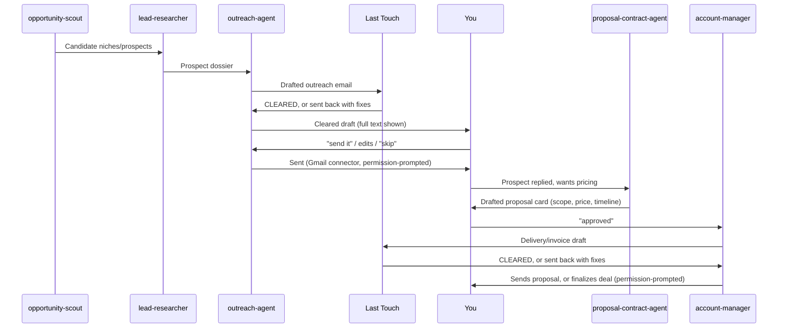

# Deal Desk — Approval Workflow

How a prospect turns into a paid client, and exactly where you're in the loop.



## Last Touch — the mandatory quality gate

Every department's client-facing output (an email, a proposal, a social
post, an invoice, a delivered build's copy) routes through **Last
Touch** before it ever reaches you for approval — not optional, not
skippable for a "quick" one:

1. **Grammar & Copy Editor** — grammar, spelling, clarity
2. **Visual & Formatting Reviewer** — layout, formatting, broken assets
3. **Tone & Sensitivity Reviewer** — offensive language, insensitive
   phrasing, anything that could upset a customer (a single flagged
   line blocks the whole piece)
4. **Brand Consistency Checker** — matches `BRAND.md` exactly (signed as
   Ava/Edgex, correct pricing, GDPR-safe for EU)
5. **Final Release Coordinator** — confirms all four passed, stamps
   **CLEARED — LAST TOUCH**, hands it back to the department that owns
   delivery

Last Touch clearing something is **not** the same as it being sent —
your approval below still happens on every single one. Last Touch's job
is making sure what you're approving is already clean, not replacing
your review.

## The two approval points

**1. Every outbound email.** `outreach-agent` and `account-manager` paste
the full email text into the chat before sending anything. You reply with
either a go-ahead, edits, or "skip this one." Nothing sends silently.

**2. Every deal.** `proposal-contract-agent` produces a short "deal card"
before anything is proposed to a client:

```
DEAL CARD
Client: <name>
Service: <one of the playbook's Section 11 offerings>
Price: $<amount>
Scope: <2-3 bullets, exactly what's included>
Timeline: <days>
Payment terms: <e.g. 50% upfront, 50% on delivery>
```

You approve, edit, or reject the card. Only after approval does
`account-manager` send it to the client or move a job into delivery.

## What never happens automatically

- No email leaves your account without the exact text being shown to you
  first.
- No price or scope is quoted to a client that wasn't in an approved deal
  card.
- No agent has standing authority to renegotiate a deal card once you've
  approved it — a client counter-offer goes back through
  `proposal-contract-agent` for a new card and a new approval.

This is slower than a fully autonomous pipeline on purpose: it's the
difference between agents doing the labor and agents making commitments
in your name.
